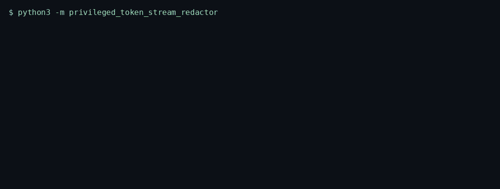
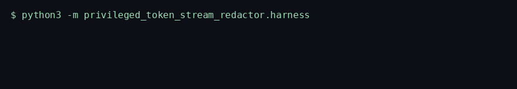
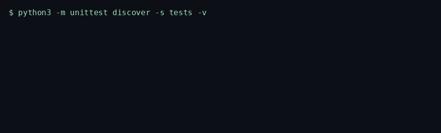

# Privileged Token Stream Redactor

> Redacts privilege banners, emails, and account-like numbers from text the caller already holds, including markers split across chunks, and chains an FNV audit record.

<p>
  <a href="https://github.com/TechieGoku2623/privileged-token-stream-redactor/actions/workflows/ci.yml"></a>
  
  
</p>

| | |
| --- | --- |
| **Website** | https://github.com/TechieGoku2623/privileged-token-stream-redactor |
| **Topics** | `python` `asyncio` `legaltech` `redaction` `privacy` `compliance` |

## The problem this solves

Legal documents arrive in chunks. An email address, a Social Security number, an account number, or a privilege banner split across two chunks misses a scanner that looks at one chunk at a time. Logging the match recreates the leak.

Privileged Token Stream Redactor keeps an overlap tail so a token on a boundary is still seen, rewrites matches to `[PRIVILEGED]` or `[ID]`, and stores an FNV-1a audit hash of what was removed. The raw match is not written to the log. A chunk past the length limit raises. Downstream systems receive text that can be handed to a model or a ticket system.

The control matches the processing-integrity and confidentiality idea associated with SOC 2.

## Walkthrough

### How it works


One real batch, in order: what went in, which gate fired, what came out.

Three recordings from this repository. Each one is the command in the frame, not a drawing.

### Engine

`python3 -m privileged_token_stream_redactor`



The overlap tail repairs a banner cut in half. A chunk past the configured maximum raises. The raw match is not logged.

### Benchmark

`python3 -m privileged_token_stream_redactor.harness`



5000 iterations, seed 20261002. The frame ends on the status line and `echo $?`.

### Tests

`python3 -m unittest discover -s tests -v`



Wire round-trip, the happy path, and both edge cases below.

## Pipeline

```
chunk
  |
  v
append to overlap buffer
  |
  v
banner / email / SSN / account
  |
  v
replace with [PRIVILEGED] or [ID]
  |
  v
pack audit record --> FNV-1a
  |
  v
{redactions, audit_fnv, split_repairs}
```

## Quick start

```bash
python3 -m venv venv
source venv/bin/activate
pip install -e ".[dev]"
python -m privileged_token_stream_redactor
python -m privileged_token_stream_redactor.harness
python -m unittest discover -s tests -v
```

Python 3.12. The runtime is the standard library. `black` and `flake8` are the `dev` extra.

## Use it

```python
import asyncio

from privileged_token_stream_redactor import PrivilegedTokenStreamRedactor


async def demo() -> None:
    engine = PrivilegedTokenStreamRedactor()
    result = await engine.run(
        [
            "ATTORNEY-CLIENT ",
            "PRIVILEGED memo for reviewer@example.com",
        ]
    )
    print(result["redactions"], result["split_repairs"])


asyncio.run(demo())
```

## Bounds

| | |
| --- | ---: |
| Iterations | 5000 |
| Average | 32.151 µs |
| P99 | 49.033 µs |
| tracemalloc peak | 175221 bytes |

Figures are from the harness on the machine that published them. A later host moves the microseconds. The pass/fail result does not.

## What it refuses

- A chunk longer than the configured maximum raises `EngineKernelException` and does not advance the counter.
- A privilege marker split across two chunks is completed from the overlap tail and counted in `split_repairs`.

Aligned with SOC 2 isolation of secrets from logs and with legal-hold integrity via the FNV audit chain. The matched text is not stored in the audit record.

## Tree

```
src/privileged_token_stream_redactor/
  engine.py       kernel
  wire.py         struct frames
  harness.py      benchmark
  __main__.py     demo entry
tests/test_engine.py
Dockerfile        non-root, uid 10001
```
